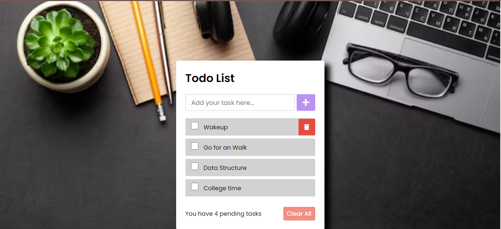
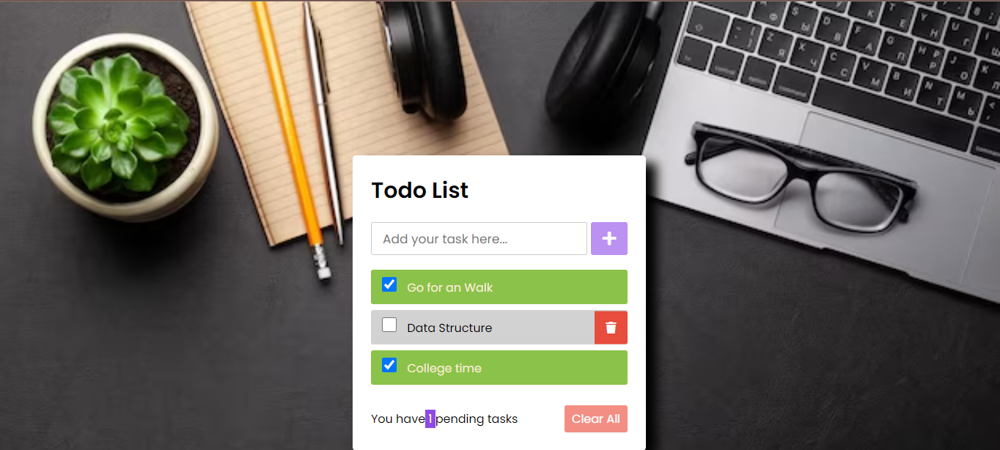

# Todo App

This is a simple Todo application where you can add tasks, mark them as completed, and delete them. The application is built using HTML, CSS, and JavaScript.

## Features

- Add new tasks to your list.
- Mark tasks as completed by checking the checkbox.
- Delete tasks individually.
- Clear all tasks at once.

## How to Use

1. Clone the repository to your local machine using `git clone <https://github.com/aishwarya-garje/Codecasa_Project.git>`.
2. Open `index.html` in your web browser.
3. Enter your task in the input field and click the "+" button to add it to your list.
4. Check the checkbox to mark a task as completed.
5. Click the trash icon to delete a task individually.
6. Click the "Clear All" button to delete all tasks.

## Screenshots

*Adding a new task to the to-do list. User clicks on 'Add Task' button after entering task details.*

*Marking a task as completed. User clicks on the checkbox next to the task to mark it as done.*

## Technologies Used

- HTML
- CSS
- JavaScript

## Author

[Aishwarya_Garje]

